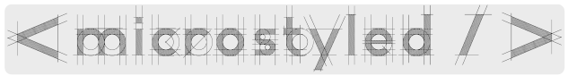

<div style="width: 100%;" class="heading-container">
	
	<div class="text">
		<span style="text-align: center; 	font-family: monospace;font-size: 20px;color: grey; margin-top: 24px;">< microstyled /></span><br><br>
		<span>A small React Component library inspired by<br><a href="https://styled-components.com" target="__blank">styled-components</a> and <a href="https://emotion.sh/docs/styled" alt="">@emotion/styled</a>.</span>
	</div>
</div>

## About
- Why?
  - I wanted something smaller and with less dependencies to use for my own projects.
  - Also, why not? 🤷
- What?
  - This project follows the 80/20 addage in supporting 20% of the features you use 80% of the time and will never be as featureful as `styled-components`, `@emotion/styled`, et al. 
  - It will provide the most commonly used functionality: tagged template based CSS styling, dynamic stylesheets, and theme support. More in the future.


## Documentation

- This is a small library so there are only two main sources of documentation, this [README.md](./README.md) and the [Typedoc generated](./docs/modules.md) documentation.

- If you are familiar with `styled-components` and `@emotion/styled` then this README.md should be sufficient.

#### Goals/Caveats:
- The goal of this project is to be as small as possible.
- There is little to no CSS validation in order to keep the library simple.
- MDX (or any component markup translation), and SASS/SCSS will not be supported.
- Currently, it only generates dynamic stylesheets for components.
- The main targeted usage is desktop and mobile browsers in NodeJS/NPM based projects.


## Examples

### CSS Styles Support

- Key/value properties

  - Root level key/value pairs can be copied "as is" from normal CSS.

  ```JSX
  import microstyled from '@caffedpkg/microstyled';
  
  // Regular key value CSS properties are written normally
  const Parent = microstyled.div`
    background-color: red;
  `;
  
  export default Parent;
  ```

  - The resultant output:

  ```JSX
  // in stylesheet container
  <style id="micro-styled-randomHash">
    .randomHash { background-color: red; }
  </style>
  
  // component HTML output minus specified props, children etc.
  <div class="randomHash"></div>
  ```


- Psuedo class properties

  - The ampersand is used as a placeholder for the component class reference
  
  ```JSX
  import microstyled from '@caffedpkg/microstyled';
  
  const Child = microstyled.div`
    font-size: 24px;
    &:hover {
      font-size: 36px;
    }
  `;
  
  export default Child;
  
  ```
  
  - The resultant output:

	
  ```JSX
  // in stylesheet container
  <style id="micro-stled-randomHash">
    .randomHash {font-size: 24px; }
    .randomHash:hover { font-size: 36px; }
  </style>
	
  // component HTML output minus specified props, children etc.
  <div class="randomHash"></div>
  ```

- Media query properties

  ```JSX
  import microstyled from '@caffedpkg/microstyled';
	
  // Media queries can also be nested inside an elements block.
  // NOTE: Currently, all nested styles must be enclosed in a "& { ... }" block.
  const Cell =  microstyled.div`
    max-width: 540px;
    @media (max-width 600px) {
      & {
        max-width: 100%;
      }
      &:hover {
        background-color: blue;
      }
    }
  `;
	
  export default Cell;
	
  ```

  - The resultant output:

  ```JSX
  // in stylesheet container
  <style id="micro-stled-randomHash">
  .randomHash { max-width: 540px; }
  @media (max-width 600px) {
    .randomHash { max-width: 100%; }
    .randomHash:hover { background-color: blue; }
  }
  </style>
  
  // component HTML output minus specified props, children etc.
  <div class="randomHash"></div>
  ```

### CSS Theme Provider Support

- There is basic support for a theme object in components created with `microstyled`.

  ```JSX
  import React from 'react';
  import microstyled, { ThemeProvider } from '@caffedpkg/microstyled';
  
  const myTheme = {
    desktop: {
      fontSize: '36px';
    },
    mobile: {
      fontSize: '24px';
    },
  };
  
  const MyTheme = ThemeProvider(myTheme);
  
  const BackgroundRed = microstyled.div`
    background-color: red;
  `;
  
  const Content = microstyled.div`
    @media (max-width: 540px) {
      & {
        font-size: ${props => (props.theme.mobile.fontSize)};
      }
    }
  `;
  
  const App = () => (
    <MyTheme>
      <BackgroundRed>
        <Content>
          Body Text.
        </Content>
      </BackgroundRed>
    </MyTheme>
  );
  ```


### CSS Theme / Stylesheet Cache Provider

- Stylesheets are added to the `document.head` by default. However, they can be pointed to any arbitrary container:

  ```JSX
  import React from 'react';
  import microstyled, { ThemeCacheProvider } from '@caffedpkg/microstyled';
  
  const StyleSheetCache = ThemeCacheProvider(async () => document.body.querySelector('#my-cache'));
  
  const Content = microstyled.div`
    font-size: 24px;
  `;
  
  const App = () => (
    <StyleSheetCache>
      <Content>
        Body Text.
      </Content>
    </StyleSheetCache>
  );
  ```

### Global Stylesheet and the `css()` helper

- Global Stylesheets are rendered whereever inserted in the App layout.

  ```JSX
  import React from 'react';
  import microstyled, { css, GlobalStylesheet } from '@caffedpkg/microstyled';
  
  const GlobalStyles = (props: any) => {
    return <GlobalStyleSheet 
       stylesheet={css(props)`
         body {
          background-color: ${(props: any) => props.theme.backgroundColor} !important;
          color: ${(props: any) => props.theme.color} !important;
        }
      `}
     />
   }
  
  const Content = microstyled.div`
    font-size: 24px;
  `;
  
  const App = () => (
    <>
       <GlobalStyles />
       <Content>
         Body Text.
       </Content>
    </>
  );
  ```
- The `css()` helper takes a props-like parameter and returns a stylesheet tag function with the props and the current theme object merged into a single 'props' object.

  ```
    // theme used in provider
    const theme = { fontSize: '24px' };
    // somewhere else
    const componentProps = { myVals: { color: 'fff' } };
    const cssString = css(componentProps)`
      body {
        color: #${props => props.myVals.color};
        font-size: ${props => props.theme.fontSize};
      }
    `;
  ```


### Template Interpolation

- Interpolation values must be a string or arrow functon.
- Arrow functions have a theme merged props object passed to it and must return a `string` castable value.

	
  ```JSX
  import microstyled from '@caffedpkg/microstyled';
  import config from './config';
  
  // interpolation must
  const Box =  microstyled.div`
    display: ${config.flex ? 'flex' : 'block'};
    ${props => `color: ${props.theme.someColorValue};`}
  `;
  
  export default Cell;
  ```

### Syntax

- Key/value statements need to have one colon `:` and one semicolon `;`.

  ```JSX
  const Box = microstyled.div`
    display: flex;
  `;
  
  ```

- Pseudo classes need to use the `&` as a className placeholder and have an opening `{` and closing `}` curly brace.

  ```JSX
  const Box = microstyled.div`
    &:nth-child(even) {
      background-color: grey;
    }
  `;
  
  ```
	

- Media queries need to use the `@media` identifier followed by a clause and have opening `{` and closing `}` curly braces with at least one nested rule. 
  - Key/value pairs curently need to be wrapped in a className reference `& { ... }`.

  ```JSX
  const Box = microstyled.div`
    grid-template-columns: 1fr 1fr;
    @media (max-width: 428px) {
      & {
        grid-template-columns: 1fr;
      }
    &:hover {
      background-color: #ccc;
    }
    }
  `;
  
  ```
	

## Roadmap

##### NOTE: This project will follow semver guidelines 


- 1.0.0 -> 1.1.x
  - Bugs, speed, refactoring, cleanup, etc.
- 1.2.0 -> 1.2.x
  - Full [CSSOM](https://developer.mozilla.org/en-US/docs/Web/API/CSS_Object_Model) parsing support.
- 1.3.0 -> 1.3.x
  - Optional [CSSStyleDeclaration](https://developer.mozilla.org/en-US/docs/Web/API/CSSStyleDeclaration) support
  - Dynamically generated stylesheets will be an "either/or" toggle.
- 1.4.0 -> 1.4.x
  - Inline component referencing using component constructors.
  - `${OtherComponent} { /* styles */ }`
- 1.5.0 -> 1.5.x
  - Image caching
- Version 1.6.0 -> 1.6.x
  - SVG support
- 1.7.0 -> 1.7.x
  - Middleware support
 
## Contributing

- Currently, there is a fixed roadmap for up to version 2.0.0 (see above). This may change at my discretion.

- Please see the [contributing guidelines](./CONTRIBUTING.md) and the [code of conduct](./CODE_OF_CONDUCT.md) for more information regarding submitting feature requests and bugs.


## License

Licensed under the MIT License, Copyright © 2022-present Carlo Mogavero.

See [LICENSE](./LICENSE) for more information.
